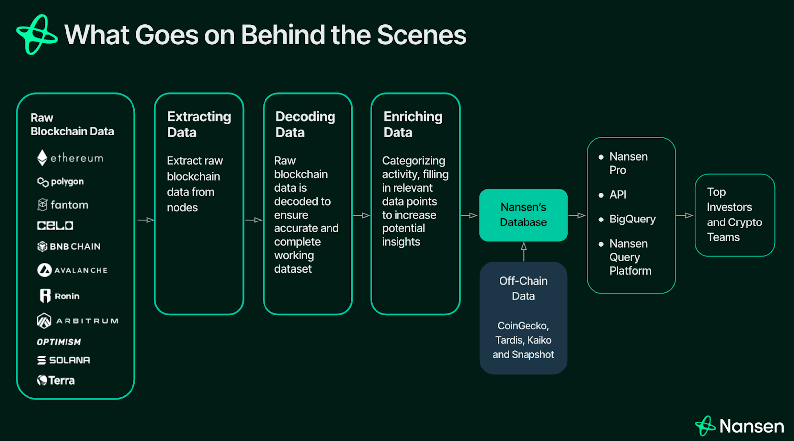

# 📊 區塊鏈使用者分析機器學習專案總覽（ML Project Overview）

本專案目錄提供一套完整的區塊鏈使用者資料分析流程，涵蓋多鏈資料收集、特徵工程、自動化機器學習（AutoML）分群，以及結果視覺化。所有模組與設定皆為了靈活調整、可重現研究與可行的業務洞察而設計，目標是深入理解使用者行為並進行有效分群。


---

## 📁 資料夾結構說明

- `ml/config/`  
  - 資料收集、特徵工程與分析流程設定檔 
- `ml/data/`  
  - `raw/`：原始區塊鏈資料  
  - `processed/`：處理後的特徵與分析結果  
  - `features/`：建模用的特徵檔案  
  - `models/`：儲存的模型與預測結果
- `ml/src/preprocessing/`  
  - 資料收集與特徵工程腳本
- `ml/src/models/kmeans/`  
  - KMeans 分群流程與分析腳本
- `ml/src/visualization/`  
  - 用於結果視覺化的工具

---

## 🧬 資料與特徵說明

**原始資料**（位於 `ml/data/raw/`）  
  - 包含區塊鏈交易記錄、事件紀錄、代幣餘額等

**處理後特徵**（位於 `ml/data/processed/`）：
  - `assets_distribution.csv`：使用者資產在不同鏈與代幣的分佈  
  - `tx_behavior.csv`：使用者交易行為特徵  
  - `raw_user_features.csv`：未經清理或彙整的原始特徵資料，請參考此 [google sheet](https://docs.google.com/spreadsheets/d/19LlNmWYfyDzuZncPNWM_FUSxIjMAJ7ZbU2_jGUsIkd4/edit?gid=535598059#gid=535598059)
  - `user_features.csv`：最終整合後、用於建模與分群的特徵檔案

**重要特徵包含：**

- `whale_score`：巨鯨識別用的綜合資產與流動性指標  
- `active_score`：衡量使用者活躍度的指標  
- `*_balance_usd`：代幣餘額（美元計）  
- `*_ratio`：資產組合比例  
- `avg_tx_usd_value_inflow/outflow`：平均單筆流入/流出金額  
- `total_tx_usd_value_inflow/outflow`：總流入/流出金額  
- `method_diversity`：合約互動多樣性熵值  
- `chain_focus`, `protocol_type_focus`：鏈與協議集中程度指數

> 🔔 **注意：** 所有特徵為多鏈聚合結果（Ethereum、Arbitrum、Base 等），並非單鏈特徵。

---

## 🚀 AutoML 流程啟動步驟

> 步驟 1 ~ 3 僅需執行一次，其餘可獨立運行以重複分析。

1. **安裝環境**
   ```bash
   make venv
   ```

2. **啟動環境** (若關閉terminal則需要再次輸入指令啟動環境)
   ```bash
   source .venv/bin/activate
   ```

3. **執行完整 AutoML 流程**
   ```bash
   make automl
   ```

4. **收集原始資料**
   ```bash
   make collect_raw_data
   ```

5. **執行特徵工程**
   ```bash
   make feature_engineering
   ```

6. **執行 KMeans 分群**
   ```bash
   make kmeans_pipeline
   ```

7. **查看分析結果**
   - 特徵檔案：`ml/data/processed/`
   - 分群結果：`ml/src/results/<timestamp>/`

8. **更新代幣價格**（需在收集資料前執行）
   ```bash
   make update_price
   ```

---

## 🛠️ Config 設定如何運作？

所有資料收集與特徵工程的參數皆透過 `ml/config/training_configs.py` 設定檔進行管理。  
你可以自訂這些 config 來控制資料收集、特徵工程與模型行為，而無需修改程式碼。

### COLLECT_RAW_DATA_CONFIG

| 參數 | 說明 |
|------|------|
| based_chain_id | 主鏈 ID（例如 Ethereum 為 1） |
| chain_ids | 欲分析的鏈 ID 列表 |
| timestamp_threshold | 最早收集的資料時間戳 |
| based_protocol_type | 協議類型，如 'Lending' |
| senders_count_threshold | 要抽樣的使用者數量 |
| senders_max_pages / logs_max_pages | API 抓取頁數上限 |
| max_workers | 並行抓取的執行緒數量 |
| use_cache | 是否使用快取資料 |

### FEATURES_ENGINEERING_CONFIG

| 參數 | 說明 |
|-----------------------|------|
| features | 最終輸出要包含的特徵欄位列表（如 whale_score, active_score 等） |
| active_days_threshold | 活躍天數的計算門檻（預設 730） |
| assets_lookback_months| 資產分布回溯的月份數（預設 12） |
| whale_score_settings | whale_score 權重設定（dict，指定各特徵的加權） |
| active_score_settings | active_score 權重設定（dict，指定各特徵的加權） |

### KMEANS_PIPELINE_CONFIG

| 參數 | 說明 |
|----------------|------|
| n_components | PCA 主成分數量，float 代表保留多少變異量（如 0.95），int 代表固定維度數（如 5） |
| analyse | 是否執行分析與視覺化步驟 |
| reduce_dimensions | 是否進行 PCA 降維 |
| optimization | 是否執行超參數最佳化（通常 production 設為 False） |

---

## ⚠️ 分析流程注意事項

- **設定 Etherscan API Key**：請到 [Etherscan](https://etherscan.io/) 申請自己的 API Key，並至 `ml/config/endpoints.py` 填入你的
- **設定 Configs**：所有預設參數皆集中於 `ml/config/` 中，請設定個人化參數 `ml/config/training_configs.py`
- **確保資料更新**：請每日執行一次 `make update_price` 確保代幣價格即時性  
- **可重現性**：所有設定、圖表與模型結果皆儲存於 `ml/src/results/`  
- **資源管理**：分析大量資料時，建議先以小樣本測試參數（如設定 `senders_count_threshold = 30`）

---

## 📈 分群分析評估指標

| 指標 | 範圍 | 建議值 | 解釋 |
|------|------|--------|------|
| Silhouette Score | -1 ~ 1 | > 0.5 | 分群凝聚與分離性，愈高愈好 |
| Davies-Bouldin Index | 0 ~ ∞ | < 1 | 群間相似度，愈低愈佳 |
| Calinski-Harabasz Index | 0 ~ ∞ | 愈高愈佳 | 群間與群內變異比值，愈高愈好 |

> 評估分群品質後，可使用工具如 [Arkham](https://platform.arkhamintelligence.com/)、[Nansen](https://app.nansen.ai/) 深入瞭解個別使用者行為與背景。

---

## ✅ 建議與常見錯誤

### ✅ 你應該要：

1. **決定目標族群與資料來源。**  
   確認你要分析哪些用戶群（如鯨魚、DeFi 活躍用戶），確保原始資料涵蓋這些行為。

2. **根據領域知識選擇關鍵特徵。**  
   運用你對區塊鏈與用戶行為的理解，挑選有意義的特徵作為建模依據。

3. **需要新特徵時主動提出。**  
   若發現目前資料缺乏關鍵訊號，可聯繫 Tanner 協助將新特徵加入資料流程中。

4. **注意特徵大小與尺度。**  
   KMeans 對特徵尺度敏感，應統一尺度（如 normalization 或 standardization）以避免偏差。

### ❌ 你不應該：

1. **重複執行 `make collect_raw_data`。**  
   資料收集非常耗費時間，除非必要，避免頻繁執行。

2. **不經篩選就使用所有欄位訓練模型。**  
   無意義或高度共線性的特徵會影響模型效果與可解釋性，務必先做特徵選擇。

3. **只用極少量特徵進行建模。**  
   特徵太少（如僅使用 2 項）會導致模型無法捕捉複雜行為，分群品質差。

4. **忽略模型評估指標。**  
   務必查看 Silhouette 分數、DB 指數與群集可解釋性等評估結果。

---

## 💡 Cursor 團隊的專業建議

- **特徵工程影響最大**：好的特徵勝過複雜的模型  
- **記錄分析流程**：有助於重現與知識傳承  
- **與業務邏輯比對結果**：確保數據解釋合理性  
- **適度使用 AutoML，自行審視結果**  
- **與開發協作，清楚提出資料需求**  
- **定期檢查模型與特徵的適用性**（防止資料漂移）

---

> 💬 **請記住：**  
> 最好的資料分析不只是技術執行，而是提出正確問題、選對資料，並在情境中批判性地解讀結果。
